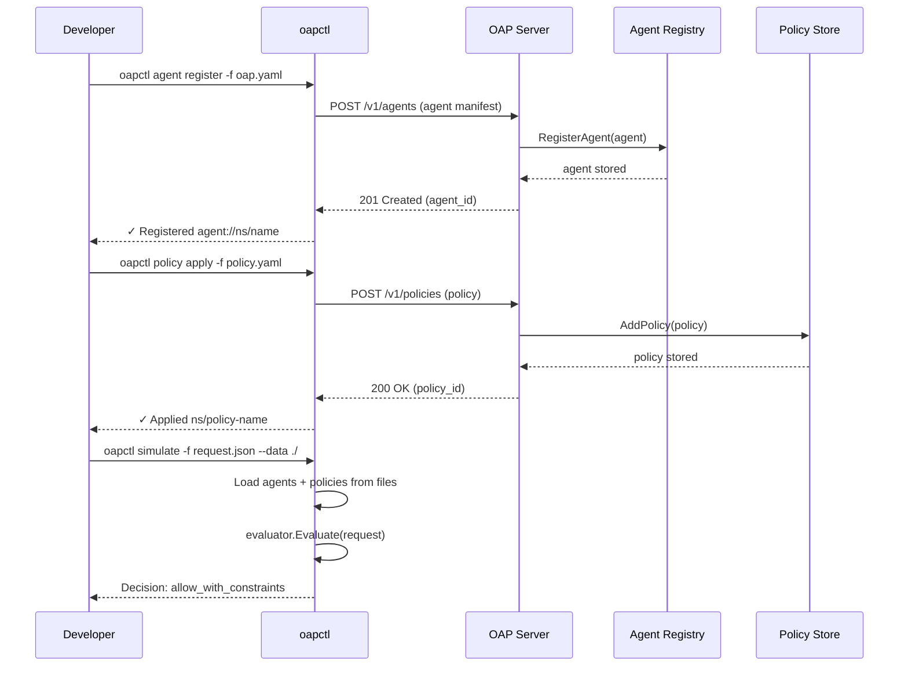

# Agent Onboarding Flow

How an agent goes from unregistered to ready-to-operate.

## Steps

1. **Register** — Developer creates an `oap.yaml` manifest declaring the agent's identity, owner, risk tier, and capabilities.
2. **Apply policy** — One or more policies are applied that reference the agent (by ID, type, namespace, or all-agents).
3. **Verify** — Developer simulates a request locally to confirm the agent will get the expected decision.
4. **Deploy** — Agent starts running with OAP enforcement (SDK, proxy, or gateway).

## Invariants

- Unregistered agents are always denied (Principle 1).
- An agent with no matching policies is denied by default (Principle 2).
- Registration does not grant any access — policies are required.
