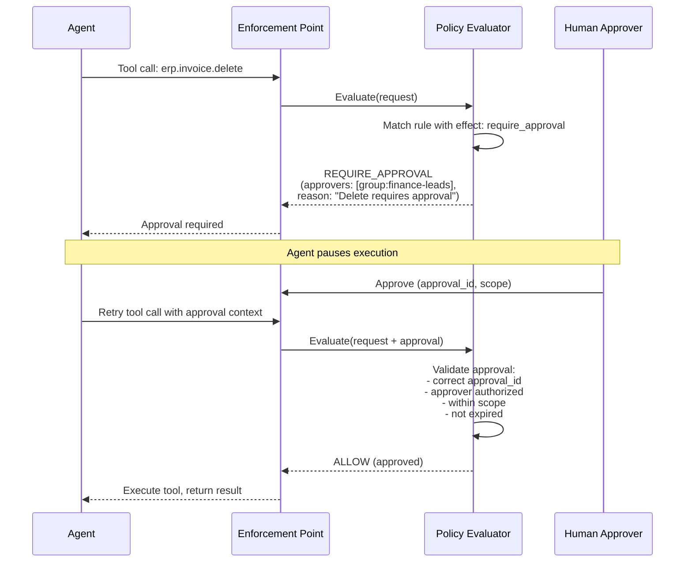

# Approval Flow

How high-risk actions require human approval before proceeding.



## Approval Rules

A policy rule with `effect: require_approval` triggers the approval flow:

```yaml
rules:
  - effect: require_approval
    actions:
      - erp.invoice.delete
    approval:
      approvers:
        - group:finance-leads
      maxWaitSeconds: 1800
```

## Invariants

- Approval cannot grant access that the agent's policies would deny.
- Approval is scoped — it only applies to the specific action and resource.
- Approval expires (default: 30 minutes).
- The approver must be in the configured approvers list.
- Audit events are emitted for both the approval request and the approved action.
