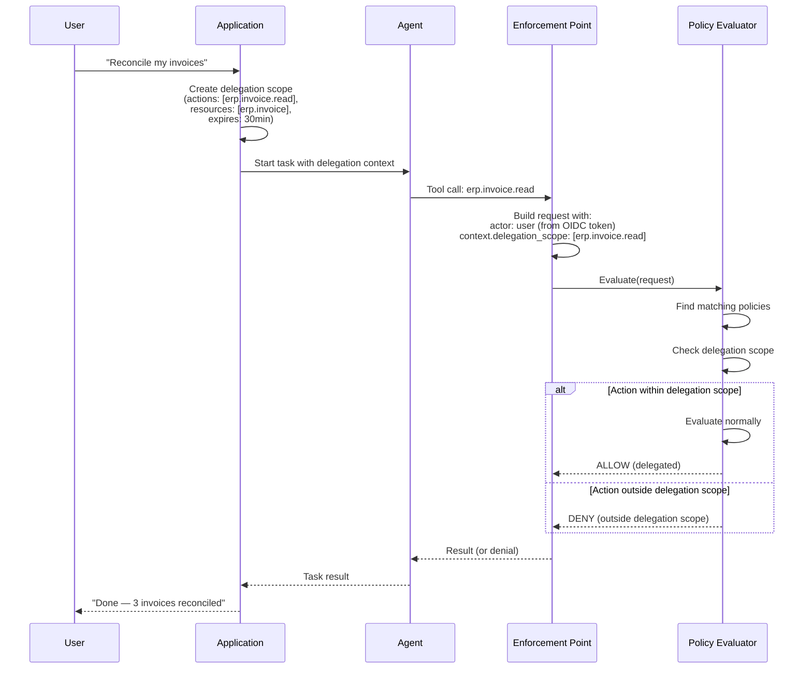

# Delegation Flow

How a user delegates authority to an agent to act on their behalf.

## Key Principles

- **Delegation must be explicit** — the user defines exactly what actions and resources the agent can access on their behalf (Principle 8).
- **Scoped** — a delegation never exceeds the delegator's own permissions.
- **Time-limited** — delegations expire.
- **Agent's own policy still applies** — delegation + agent policy must both allow the action.

## Delegation Scope Enforcement

The evaluator checks delegation in two places:
1. **Condition: delegationRequired** — a policy rule can require that the action is performed under a delegation (actorRequired is a related condition).
2. **Scope check** — if `context.delegation_scope` is present, the requested action must be within that scope.
