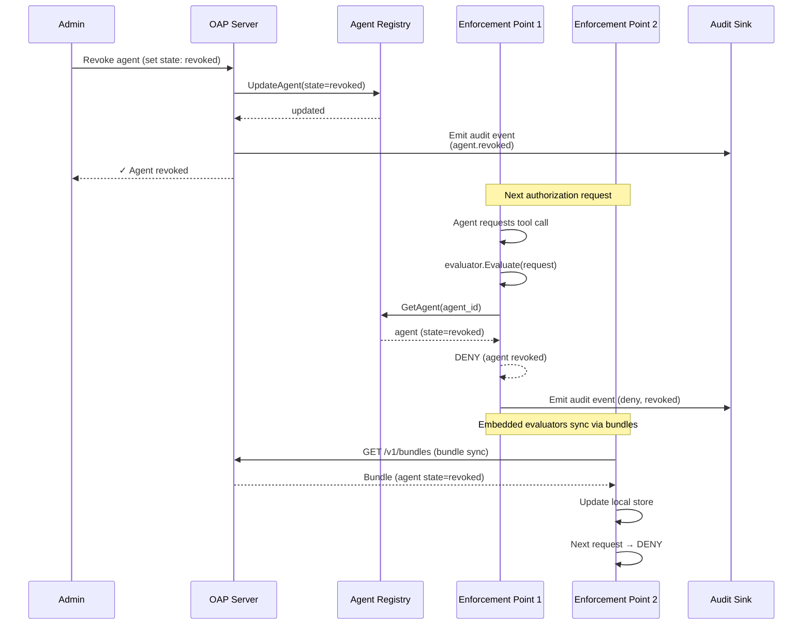

# Revocation Flow

How an agent or grant is revoked, immediately cutting off access.

## Revocation Types

| Type | Scope | Effect |
|---|---|---|
| **Agent revocation** | All actions by this agent | Agent status set to `revoked`, all requests denied |
| **Agent suspension** | All actions by this agent | Agent status set to `suspended`, all requests denied (reversible) |
| **Grant revocation** | Specific grant token | Grant marked invalid, enforcement points reject the JWT |
| **Policy removal** | Actions covered by the policy | Agent loses the permissions from that policy |

## Propagation

- **Server-connected enforcement points** — immediate (next request checks live registry)
- **Embedded evaluators** — on next bundle sync (configurable interval, default 30s)
- **JWT grants** — on expiry (grants are short-lived, typically 15 min)

## Invariants

- Revoked agents are denied regardless of policies (even allow-all).
- Suspended agents are denied but can be reactivated.
- Expired grants are invalid (checked at verification time).
- Audit events are emitted for revocation actions and subsequent denials.
