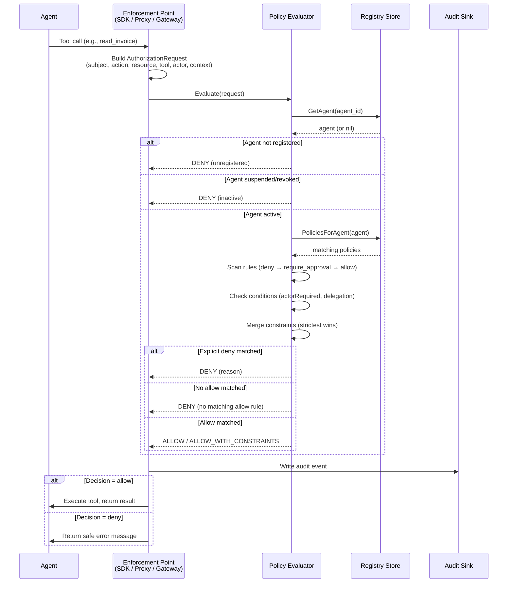

# Runtime Authorization Flow

How every agent tool call is authorized at runtime.

## Evaluation Order

1. Validate request (agent_id, action required)
2. Verify agent is registered and active
3. Find matching policies (by agent ID, type, namespace, or all-agents)
4. Scan all rules across all matching policies
5. **Deny rules first** — any match → deny (Principle 3)
6. **Require-approval rules** — any match → require_approval
7. **Allow rules** — any match → allow
8. No matching allow → deny by default (Principle 2)
9. Merge constraints from all matching allow rules (strictest wins)
10. Emit audit event (Principle 5)

## Constraint Merging

When multiple allow rules match, constraints are merged conservatively:
- **Numeric** (max_records): take the minimum
- **Boolean** (readonly): true wins over false
- **Arrays** (redact_fields): union of all values
