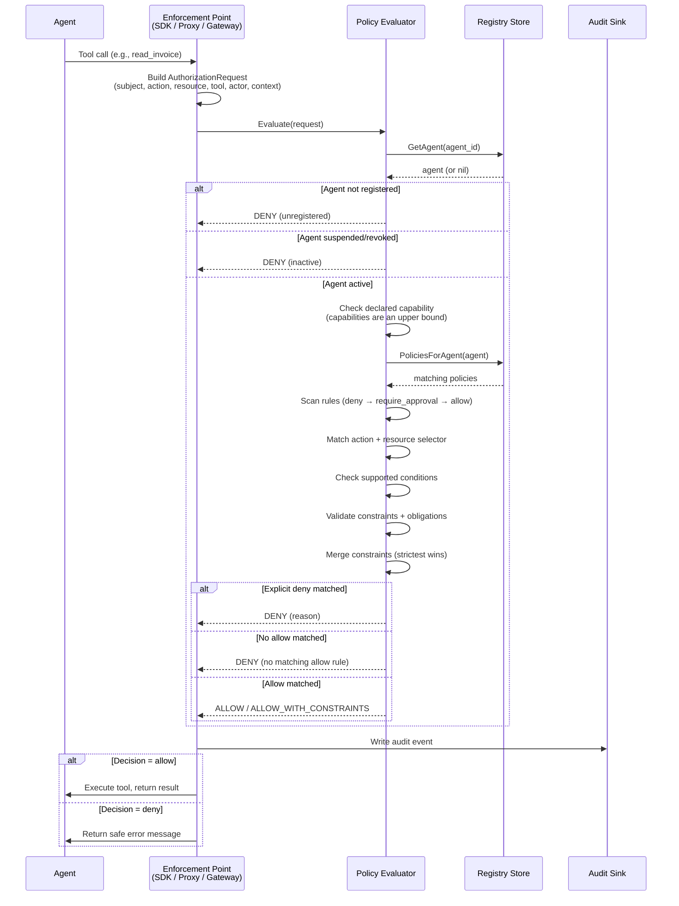
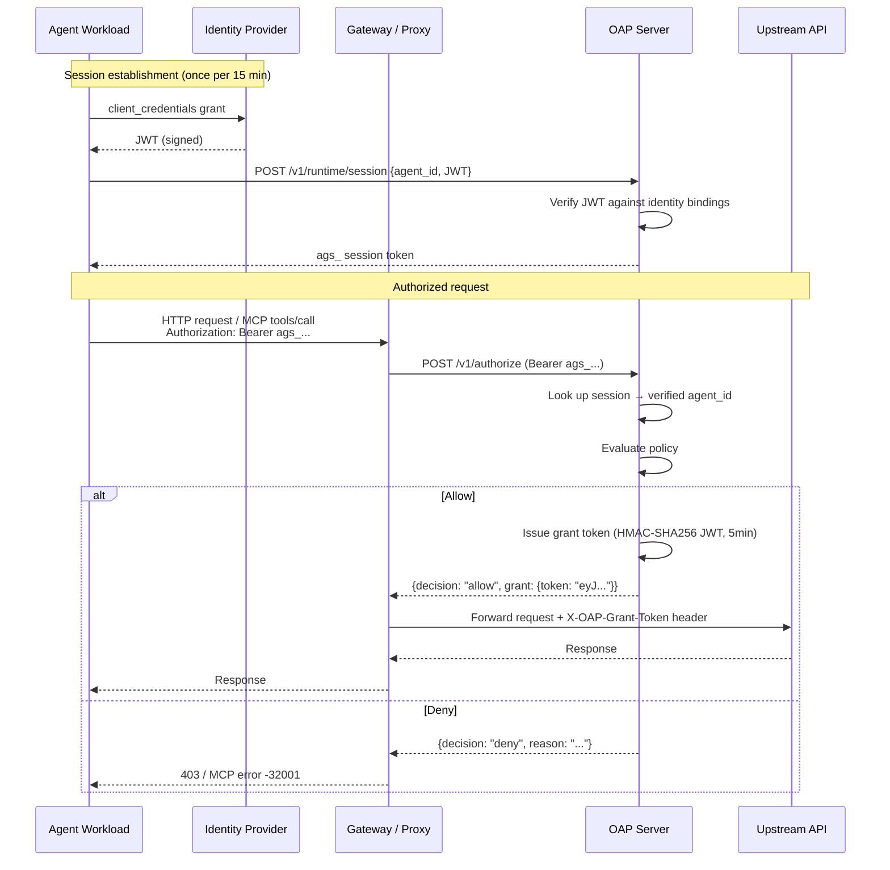
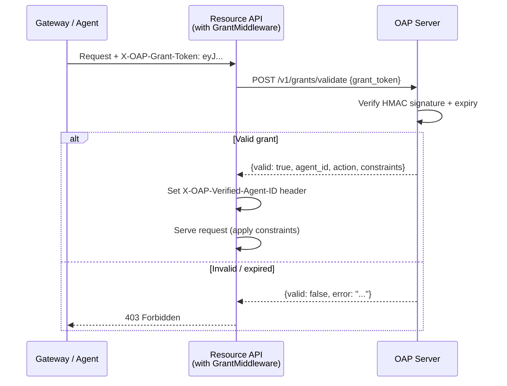

# Runtime Authorization Flow

How every agent tool call is authorized at runtime.

## Flow 1: Embedded mode (local evaluator)

Used when the gateway, proxy, or SDK has a local policy store.

## Flow 2: Remote mode with sessions and grants

Used when the gateway/proxy delegates to a centralized OAP server. Includes
identity verification, session management, and grant token issuance.

## Flow 3: Resource-side grant validation

Resource APIs independently verify grant tokens to confirm authorization.

## Evaluation Order

1. Validate request (agent_id, action required)
2. Verify agent is registered and active
3. Check the requested action is within the agent's declared capabilities
4. Find matching policies (by agent ID, type, namespace, or all-agents)
5. Check delegation scope when delegation context is present
6. Scan all rules across all matching policies
7. Match action and resource selector
8. Evaluate supported conditions
9. Validate constraints and obligations
10. **Deny rules first** - any match -> deny (Principle 3)
11. **Require-approval rules** - any match -> require_approval
12. **Allow rules** - any match -> allow
13. No matching allow -> deny by default (Principle 2)
14. Merge constraints from all matching allow rules (strictest wins)
15. Emit audit event (Principle 5)

## Constraint Merging

When multiple allow rules match, constraints are merged conservatively:
- **Numeric** (maxRecords): take the minimum
- **Boolean** (readonly): true wins over false
- **Arrays** (redact): union of all values
- **Arrays** (allowedFields): intersection wins

## Fail-Closed Policy Vocabulary

The built-in evaluator rejects unsupported condition, constraint, and obligation keys.
For example, `priorityIn` and `recipientDomain` are not enforced unless they are
added to the spec and evaluator. Unknown policy vocabulary is treated as a policy
error, not as an advisory hint.
