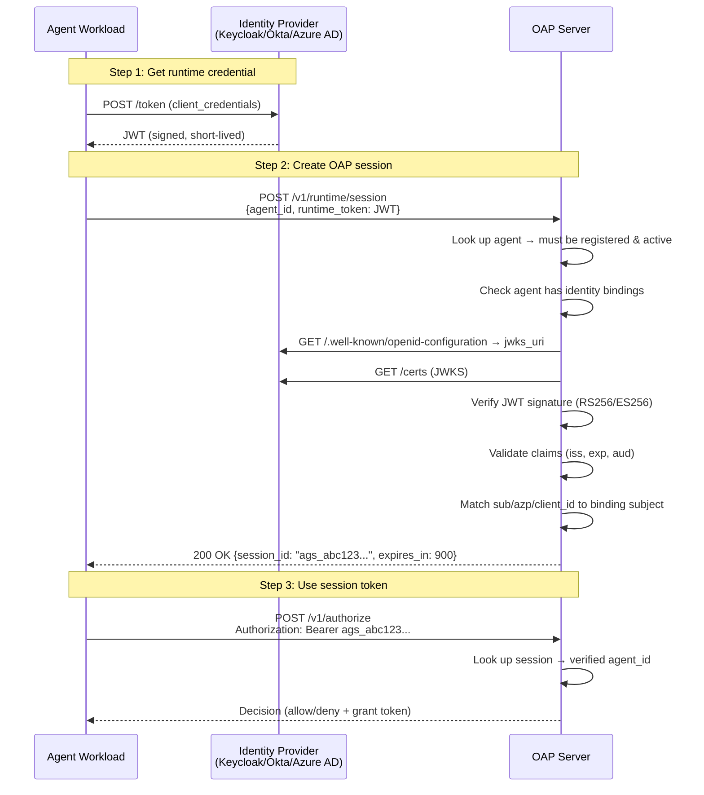
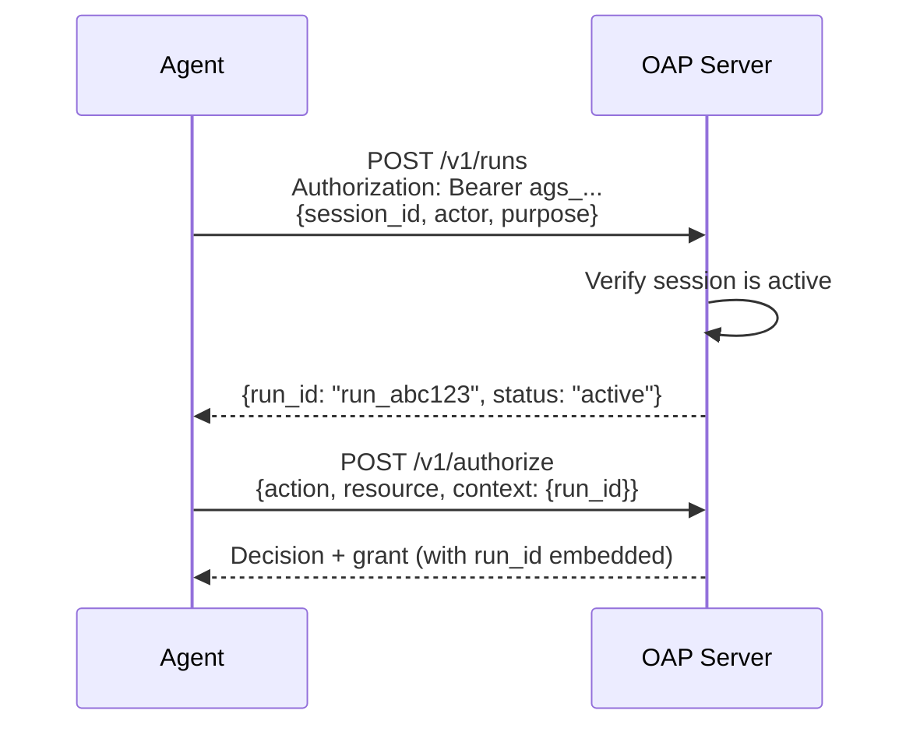
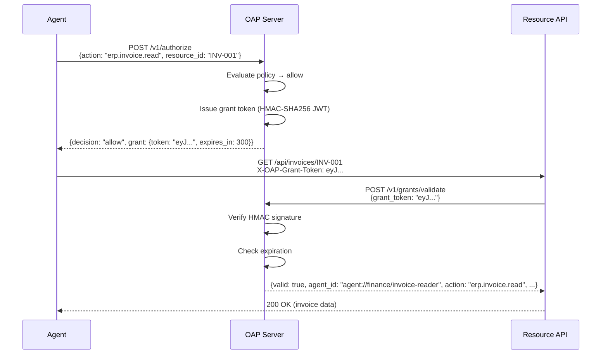
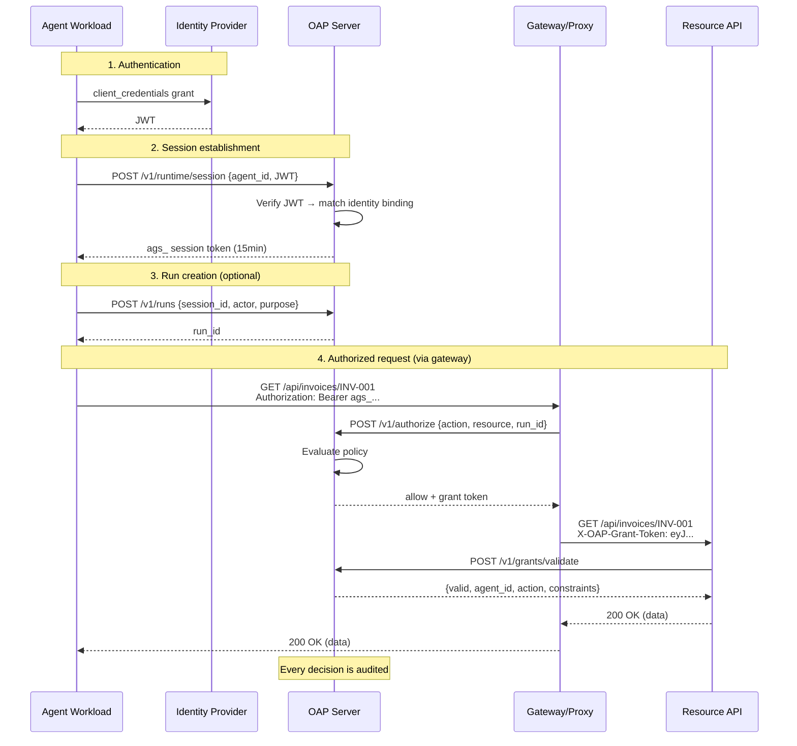

# Identity, Sessions & Grants

This guide covers how OAP verifies agent identity, manages authenticated sessions,
tracks execution runs, and issues scoped grant tokens — the full zero-trust
authentication and authorization chain.

---

## Why identity matters

Without identity verification, any workload can claim to be any agent by setting
a header. OAP eliminates this by requiring agents to **prove** their identity
using cryptographic tokens issued by trusted identity providers.

```
WITHOUT identity binding:
  Agent sends "agent_id: agent://finance/reconciler" as a header
  → Anyone can impersonate any agent

WITH identity binding:
  Agent presents a JWT signed by Keycloak/Okta/Azure AD
  → OAP verifies the JWT signature, issuer, and subject
  → Only the real agent workload can claim that identity
```

---

## Workload identity profile

OAP separates the logical agent identity from the runtime workload identity:

| Identity | Example | Purpose |
|---|---|---|
| Logical OAP ID | `agent://finance/invoice-reader` | Stable policy subject used in OAP decisions. |
| Workload identity | `spiffe://example.org/ns/finance/sa/invoice-reader` | Standards-compatible identity presented by the deployed workload. |

Use `spec.workloadIdentity` to record the workload identity profile. Prefer a
SPIFFE ID when the runtime can provide one; otherwise use another stable
WIMSE-compatible URI.

```yaml
spec:
  workloadIdentity:
    id: spiffe://example.org/ns/finance/sa/invoice-reader
    type: spiffe
    trustDomain: example.org
    attestationLevel: platform
```

## Identity bindings

An identity binding maps a **verifiable runtime credential** to a logical agent.
You declare bindings in the agent manifest:

```yaml
apiVersion: oap.dev/v1alpha1
kind: Agent
metadata:
  name: invoice-reader
  namespace: finance
spec:
  workloadIdentity:
    id: spiffe://example.org/ns/finance/sa/invoice-reader
    type: spiffe
    trustDomain: example.org
  identityBindings:
    - type: oidc_client
      provider: keycloak
      issuer: "https://auth.company.com/realms/agents"
      subject: "invoice-reader-client"
```

### Binding fields

| Field | Required | Description |
|---|---|---|
| `type` | Yes | Identity mechanism (see supported types below) |
| `provider` | No | Human-readable provider name (e.g., "keycloak", "okta") |
| `issuer` | Yes | Expected `iss` claim in the token (must be an HTTPS URL) |
| `jwksUri` | No | Explicit JWKS or SPIFFE bundle endpoint when OIDC discovery is not available |
| `subject` | Yes | Expected identity: matched against `sub`, `azp`, or `client_id` claims |
| `audience` | No | Expected `aud` claim. For WIMSE, this is an accepted WPT audience or deployment alias. |

### Supported identity binding types

| Type | Constant | How it works | Token source |
|---|---|---|---|
| **OIDC Client Credentials** | `oidc_client` | Agent workload gets a JWT via OAuth2 `client_credentials` grant. OAP verifies the JWT's signature (JWKS), issuer, and subject/client_id. | Keycloak, Okta, Azure AD, Auth0, Google, Cognito, PingIdentity, any OIDC provider |
| **Kubernetes Service Account** | `kubernetes_service_account` | K8s 1.21+ projects OIDC-compatible JWTs for ServiceAccounts. OAP verifies via the cluster's OIDC JWKS endpoint. | Kubernetes projected volume token |
| **SPIFFE JWT-SVID** | `spiffe` | SPIRE agent provides JWT SVIDs for workloads. OAP verifies the JWT, requires an audience, and only uses `jwt-svid` signing keys from the bundle. | SPIFFE workload API |
| **WIMSE WIT + WPT** | `wimse` | OAP verifies the WIT against the issuer, extracts `cnf.jwk`, verifies the request-bound Workload Proof Token, checks `wth`/`aud`/`exp`/`jti`, and rejects replay within the WPT window. | WIMSE-style identity services |

### Subject matching rules

OAP matches the binding's `subject` against multiple JWT claims in this order:

1. **`sub` claim** — standard JWT subject
2. **`azp` claim** — authorized party (common in Keycloak/OIDC)
3. **`client_id` claim** — OAuth2 client identifier

You can also use the `client_id:` prefix for explicit matching:

```yaml
# Match any of: sub="support-agent", azp="support-agent", client_id="support-agent"
subject: "support-agent"

# Only match azp or client_id, not sub
subject: "client_id:support-agent"

# Kubernetes ServiceAccount format
subject: "system:serviceaccount:agents:invoice-reader"

# SPIFFE JWT-SVID format; the binding subject must equal the token sub
subject: "spiffe://example.org/ns/finance/sa/invoice-reader"

# WIMSE workload identifier format; WIMSE sessions also require a WPT
subject: "wimse://trust.example.com/service/payment"
```

---

## Supported identity providers

### Tier 1 — Tested and production-ready

| Provider | Binding type | Issuer URL pattern | Subject |
|---|---|---|---|
| **Keycloak** | `oidc_client` | `https://keycloak.example.com/realms/{realm}` | Client ID or service account name |
| **Okta** | `oidc_client` | `https://{org}.okta.com` or custom auth server | Client ID |
| **Azure AD / Entra ID** | `oidc_client` | `https://login.microsoftonline.com/{tenant}/v2.0` | Application (client) ID |
| **Google Cloud** | `oidc_client` | `https://accounts.google.com` | Service account email |
| **AWS Cognito** | `oidc_client` | `https://cognito-idp.{region}.amazonaws.com/{poolId}` | App client ID |
| **Auth0** | `oidc_client` | `https://{tenant}.auth0.com/` | Client ID |

### Tier 2 — Workload identity

| Provider | Binding type | Issuer URL pattern | Subject |
|---|---|---|---|
| **Kubernetes** | `kubernetes_service_account` | `https://kubernetes.default.svc` (or custom) | `system:serviceaccount:{ns}:{name}` |
| **GCP Workload Identity** | `oidc_client` | `https://accounts.google.com` | Service account email |
| **AWS IAM Roles** | `oidc_client` | OIDC provider URL configured in IAM | Role session name |
| **SPIFFE / SPIRE** | `spiffe` | SPIRE OIDC Discovery Provider issuer or explicit `jwksUri` | SPIFFE ID (e.g., `spiffe://domain/agent/invoice-reader`) |
| **WIMSE identity server** | `wimse` | HTTPS issuer and explicit `jwksUri` when discovery is unavailable | Workload identifier (e.g., `wimse://trust.example.com/service/payment`) |

### Deferred (not yet implemented)

| Provider | Binding type | Status |
|---|---|---|
| **mTLS certificates** | `mtls` | Planned — extract CN/SAN from client certificate |
| **X.509 SPIFFE-SVID** | `spiffe_x509` | Planned — validate X.509 SVID against trust bundle |
| **Signed deployment metadata** | `deployment_attestation` | Planned — custom attestation format |
| **Container image digest** | (policy constraint) | Planned — not identity, attestation-based |

---

## Multiple identity bindings

An agent can have multiple bindings for different environments:

```yaml
spec:
  identityBindings:
    # Production: Okta OIDC
    - type: oidc_client
      provider: okta
      issuer: "https://mycompany.okta.com"
      subject: "invoice-reader-prod"

    # Staging: Keycloak
    - type: oidc_client
      provider: keycloak
      issuer: "https://keycloak.staging.company.com/realms/agents"
      subject: "invoice-reader-staging"

    # Kubernetes workload
    - type: kubernetes_service_account
      issuer: "https://kubernetes.default.svc"
      subject: "system:serviceaccount:finance:invoice-reader"

    # SPIFFE JWT-SVID
    - type: spiffe
      provider: spire
      issuer: "https://spire.company.com"
      jwksUri: "https://spire.company.com/.well-known/jwks.json"
      subject: "spiffe://company.com/ns/finance/sa/invoice-reader"
      audience: "oap-server"
```

OAP tries each binding in order. The first one that matches the presented token succeeds.

---

## Session lifecycle

Sessions are the primary authentication mechanism at runtime. Once an agent proves
its identity, OAP issues a short-lived session token that replaces the need to
re-validate the JWT on every request.

### Session creation flow



### Session token format

- **Prefix:** `ags_` (agent session)
- **Length:** 68 characters (4 prefix + 64 hex from 32 random bytes)
- **TTL:** 15 minutes (configurable via `SessionTTL`)
- **Storage:** In-memory (server-side)

### Session states

| State | Meaning |
|---|---|
| `active` | Valid, can be used for authorization |
| `expired` | TTL exceeded, must create a new session |
| `revoked` | Explicitly invalidated |

### API

```
POST /v1/runtime/session
Content-Type: application/json

{
  "agent_id": "agent://finance/invoice-reader",
  "runtime_token": "eyJhbGciOiJSUzI1NiIs...",
  "workload_proof_token": "eyJhbGciOiJFUzI1NiIs...",
  "instance": {
    "environment": "production",
    "host": "invoice-reader-7b4d8f-xyz",
    "namespace": "finance"
  }
}

→ 200 OK
{
  "session_id": "ags_a1b2c3d4e5f6...",
  "agent_id": "agent://finance/invoice-reader",
  "status": "active",
  "mode": "enforce",
  "expires_in": 900,
  "expires_at": "2026-05-28T01:15:00Z"
}
```

### Python SDK

```python
from open_agent_policy import OAPClient

client = OAPClient(server_url="http://oap-server:8080")

# Get OIDC token from your IdP
jwt = get_client_credentials_token(
    token_url="https://auth.company.com/realms/agents/protocol/openid-connect/token",
    client_id="invoice-reader-client",
    client_secret=os.environ["CLIENT_SECRET"],
)

# Create session — proves agent identity
session = client.create_session(
    agent_id="agent://finance/invoice-reader",
    runtime_token=jwt,
)
# client.session_token is now set automatically
# All subsequent calls use Bearer ags_...
```

For WIMSE, the `runtime_token` is the Workload Identity Token and
`workload_proof_token` is the Workload Proof Token:

```python
session = client.create_session(
    agent_id="agent://payments/payment-agent",
    runtime_token=wit,
    workload_proof_token=wpt,
)
```

WIMSE-native clients may also send `Workload-Identity-Token` and
`Workload-Proof-Token` headers to `POST /v1/runtime/session`.

---

## Runs — execution context tracking

A **run** represents one task or execution within a session. It tracks:
- **Who** triggered the action (the human actor)
- **Why** (the purpose)
- **When** it started

Runs provide accountability: every authorization decision can be traced to a
specific run, which traces to a specific actor.

### Run creation flow



### API

```
POST /v1/runs
Authorization: Bearer ags_a1b2c3d4...
Content-Type: application/json

{
  "session_id": "ags_a1b2c3d4...",
  "actor": {
    "type": "user",
    "id": "alice@company.com"
  },
  "purpose": "Monthly invoice reconciliation"
}

→ 200 OK
{
  "run_id": "run_e5f6a7b8...",
  "session_id": "ags_a1b2c3d4...",
  "agent_id": "agent://finance/invoice-reader",
  "status": "active"
}
```

### Python SDK

```python
run = client.create_run(
    actor_type="user",
    actor_id="alice@company.com",
    purpose="Monthly invoice reconciliation",
)
print(run["run_id"])  # "run_e5f6a7b8..."
```

---

## Grant tokens — scoped proof of authorization

When OAP allows an action, it issues a **grant token** — a short-lived,
HMAC-SHA256 signed JWT that proves the agent was authorized for a specific action
on a specific resource. The agent presents this token to the resource API.

### Why grant tokens?

```
WITHOUT grants:
  Agent is authorized by OAP → calls resource API
  Resource API has no way to verify the agent was actually authorized
  → Trusts the request blindly or has its own separate authz

WITH grants:
  Agent is authorized by OAP → receives grant token
  Agent sends grant token to resource API
  Resource API validates grant with OAP → knows exactly who, what, why
  → Cryptographic proof of authorization
```

### Grant token claims

| Claim | Type | Description |
|---|---|---|
| `iss` | string | Issuer (OAP server) |
| `sub` | string | Agent ID |
| `aud` | string | Target resource API audience |
| `exp` | int64 | Expiration timestamp |
| `iat` | int64 | Issued at timestamp |
| `jti` | string | Unique grant ID (= decision ID) |
| `oap_action` | string | Authorized action |
| `oap_resource_type` | string | Resource type |
| `oap_resource_id` | string | Resource ID |
| `oap_decision` | string | `allow` or `allow_with_constraints` |
| `oap_policy_ids` | string[] | Policies that contributed to the decision |
| `oap_constraints` | object | Constraints (max_records, redact_fields, etc.) |
| `oap_run_id` | string | Run ID (if present) |

### Grant properties

- **Signing:** HMAC-SHA256 (configurable via `--grant-key`)
- **TTL:** 5 minutes (default)
- **Scope:** Single action + single resource
- **Non-replayable:** Tied to a specific decision ID

### Grant flow



### Resource-side validation options

#### Option A: Go grant middleware

```go
import "github.com/proishan11/open-agent-policy/gateway"

mw := gateway.NewGrantMiddleware(gateway.GrantMiddlewareConfig{
    OAPServerURL: "http://oap-server:8080",
})
http.Handle("/api/", mw.Wrap(myAPIHandler))

// Inside your handler:
func myAPIHandler(w http.ResponseWriter, r *http.Request) {
    agentID := r.Header.Get("X-OAP-Verified-Agent-ID")
    action  := r.Header.Get("X-OAP-Verified-Action")
    runID   := r.Header.Get("X-OAP-Run-ID")
    // Serve the request knowing exactly who is calling and why
}
```

#### Option B: Direct API call

```python
# Any language — call the validation endpoint
result = requests.post("http://oap-server:8080/v1/grants/validate", json={
    "grant_token": request.headers["X-OAP-Grant-Token"]
}).json()

if result.get("valid"):
    print(f"Agent: {result['agent_id']}, Action: {result['action']}")
```

#### Option C: Python SDK

```python
result = client.validate_grant(grant_token=token)
```

---

## Complete end-to-end flow

Putting it all together — from agent startup to authorized resource access:



### Token lifecycle summary

| Token | Issued by | TTL | Purpose |
|---|---|---|---|
| **Runtime JWT** | Identity Provider (Keycloak/Okta) | Provider-configured (typically 5-60 min) | Prove agent identity |
| **Session token** (`ags_`) | OAP Server | 15 minutes (configurable) | Authenticate subsequent OAP requests |
| **Grant token** | OAP Server | 5 minutes (configurable) | Prove authorization to resource APIs |

---

## Server configuration

### Start with identity verification

```bash
bin/oap-server \
  --data policies/ \
  --issuer "https://auth.company.com/realms/agents" \
  --grant-key "$(openssl rand -hex 32)"
```

| Flag | Description |
|---|---|
| `--issuer` | Expected JWT issuer (enables auth middleware for raw JWTs) |
| `--grant-key` | HMAC secret for grant token signing (random key generated if omitted) |

### JWKS caching

OAP automatically:
1. Discovers the JWKS endpoint via `{issuer}/.well-known/openid-configuration`
2. Falls back to `{issuer}/protocol/openid-connect/certs` (Keycloak)
3. Caches JWKS for 1 hour
4. Supports RS256, RS384, RS512, ES256, ES384, PS256 signature algorithms
5. Matches keys by `kid` (key ID) header, with algorithm-based fallback

---

## Provider-specific setup

### Keycloak

```yaml
# Agent manifest
identityBindings:
  - type: oidc_client
    provider: keycloak
    issuer: "https://keycloak.company.com/realms/agents"
    subject: "invoice-reader"  # Keycloak client ID
```

```bash
# Get a token
curl -X POST https://keycloak.company.com/realms/agents/protocol/openid-connect/token \
  -d "grant_type=client_credentials" \
  -d "client_id=invoice-reader" \
  -d "client_secret=$SECRET"
```

### Okta

```yaml
identityBindings:
  - type: oidc_client
    provider: okta
    issuer: "https://mycompany.okta.com/oauth2/default"
    subject: "0oa1abc2def3ghi4j5k6"  # Okta client ID
    audience: "api://oap"
```

### Azure AD / Entra ID

```yaml
identityBindings:
  - type: oidc_client
    provider: azure-ad
    issuer: "https://login.microsoftonline.com/{tenant-id}/v2.0"
    subject: "{application-client-id}"
    audience: "api://{api-client-id}"
```

### Kubernetes ServiceAccount

```yaml
identityBindings:
  - type: kubernetes_service_account
    issuer: "https://kubernetes.default.svc"
    subject: "system:serviceaccount:finance:invoice-reader"
```

```yaml
# Pod spec — project a token
volumes:
  - name: oap-token
    projected:
      sources:
        - serviceAccountToken:
            audience: "oap-server"
            expirationSeconds: 3600
            path: token
```

### Google Cloud

```yaml
identityBindings:
  - type: oidc_client
    provider: google
    issuer: "https://accounts.google.com"
    subject: "invoice-reader@myproject.iam.gserviceaccount.com"
```

### WIMSE

```yaml
identityBindings:
  - type: wimse
    provider: wimse-idp
    issuer: "https://identity.company.com/workloads"
    jwksUri: "https://identity.company.com/workloads/jwks.json"
    subject: "wimse://company.com/service/payment-agent"
    audience: "oap-server"
```

At session creation, OAP verifies the WIT signature and subject, extracts
`cnf.jwk`, verifies the WPT with that key, checks the WPT `wth` hash against the
WIT, validates the WPT audience, and rejects repeated `jti` values in the WPT
validity window.

---

## Security properties

| Property | How OAP enforces it |
|---|---|
| **No impersonation** | JWT signature verified against IdP's public keys (JWKS) |
| **No replay** | Tokens have expiration; WIMSE WPT `jti` values are replay-checked in-process; grant tokens have unique decision IDs |
| **No escalation** | session binds to one agent; grant binds to one action+resource |
| **Fail-closed** | Missing token, invalid signature, expired token → deny |
| **Audit trail** | Every session creation, authorization, and grant validation logged |
| **Short-lived** | Session tokens 15min, grant tokens 5min — limits blast radius |

---

## Next steps

- [Authentication Protocols](authentication-protocols.md) — Protocol-by-protocol setup guides
- [Getting Started](getting-started.md) — Install and first integration
- [Writing Policies](writing-policies.md) — Policy authoring guide
- [Integration Guide](integration.md) — SDK, gateway, proxy, middleware
- [Agent Onboarding Flow](../flows/agent-onboarding.md) — Registration sequence diagram
- [Runtime Authorization Flow](../flows/runtime-authorization.md) — Evaluation sequence diagram
